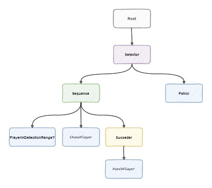
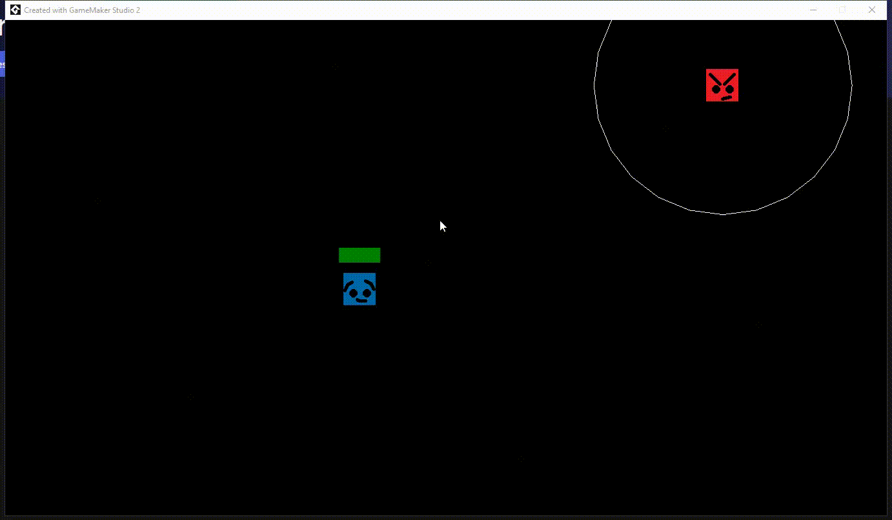

<div align="center" />


<div align="left" />

# GML Behavior Tree

The classic Behavior Tree to GMS 2.3+


## How to use

    You can see this example with the projects file. 
    We choose no enter in game maker details like objects, etc.
    it's just the Behavior tree use.

This example implements this tree:



> before mount your behavior tree try figure out about it and make a diagram like that

First of all we create our Leaf nodes inside a script file

``` gml
behavior_chase.gml

/// @param obj_ref
/// @param range 
function TaskInstanceInRange(obj, range) : BTreeLeaf() constructor {
	name = "Task Instance In Range";
	object_find = obj;
	range_limit = range;
	
	instance_ref = noone;

	/// @override
	static Init = function(){
		instance_ref = instance_find(object_find, 0);	
	}
	
	/// @override
	static Process = function(){
		if(instance_exists(instance_ref) && point_distance(black_board_ref.user.x, black_board_ref.user.y, instance_ref.x, instance_ref.y) <= range_limit)
			return BTStates.Success;
		else 
			return BTStates.Failure;
	}
}
```

> remember: the process need to return a BTStates state

See that in the Init method we start the behavior variables while in Process method we run the behavior. The tree general data stay in the blackboard. 
Notice that the behavior can receive some parameters to promote reuses

After the TaskInstanceInRange is ready we create the other behaviors:

<br/>
<details><summary>Click here to see  some code</summary>

``` gml 
behavior_chase.gml

...
/// @param speed
/// @param timer_secs
function TaskPatrolSimple(speed, timer_secs) : BTreeLeaf() constructor {
	name = "Taks Patrol Simple";
	patrol_speed = speed;
	
	patrol_spd_x = 0;
	patrol_spd_y = 0;
	
	patrol_direction = 0;
	patrol_timer_max = timer_secs * room_speed;
	patrol_timer = 0;
	
	/// @override
	static Process = function(){
		if(--patrol_timer <= 0){
			patrol_direction = irandom(360);
			patrol_spd_x = lengthdir_x(patrol_speed, patrol_direction);
			patrol_spd_y = lengthdir_y(patrol_speed, patrol_direction);
			patrol_timer = patrol_timer_max;
		}
		
		black_board_ref.user.x += patrol_spd_x;
		black_board_ref.user.y += patrol_spd_y;
		return BTStates.Success;
	}
}

/// @param instance_chase
/// @param speed_chase 
/// @param distance_max
/// @param distance_min
function TaskChaseInstance(instance_chase, speed_chase, distance_max, distance_min) : BTreeLeaf() constructor{
	name = "Task Chase Instance";
	
	chase_speed = speed_chase;
	instance_to_chase = instance_chase;
	distance_maximun_to_stop_chase = distance_max;
	distance_minimun_to_stop_chase = distance_min;
	
	///@override
	static Process = function(){
		if(instance_exists(instance_to_chase)){
			
			// Check Stop chasing
			var _dist = point_distance(black_board_ref.user.x, black_board_ref.user.y, instance_to_chase.x, instance_to_chase.y);
			if(_dist <= distance_minimun_to_stop_chase)
				return BTStates.Success;
			else if (_dist >= distance_maximun_to_stop_chase)
				return BTStates.Failure;
			else {
				// Moving towards chasing
				var _dir = point_direction(black_board_ref.user.x, black_board_ref.user.y, instance_to_chase.x, instance_to_chase.y);
				black_board_ref.user.x += lengthdir_x(chase_speed, _dir);
				black_board_ref.user.y += lengthdir_y(chase_speed, _dir);		
		
				return BTStates.Running;
			}
		}
		else 
			return BTStates.Failure

	}
	
}

/// @param instance_target
/// @param secs_between_hits 
function TaskMeleeHitTarget(instance_target, secs_preparation) : BTreeLeaf() constructor{
	name = "Task Melee Hit on Target";
	
	target_hit = instance_target;
	time_preparation_max = secs_preparation * room_speed;
	time_preparation = 0;
	
	/// @override
	static Process = function(){
		if(!instance_exists(target_hit)) return BTStates.Failure;
		if(++time_preparation >= time_preparation_max){
			time_preparation = 0;
			target_hit.life -= 10;
			return BTStates.Success;
		}
		else 
			return BTStates.Running;
	}
}
```
</details>
<br/>
With our behaviors done we can finally make our tree based on the diagram.

To mount the tree we first instantiate the nodes

``` gml
o_enemy -> create

/// @desc bt Start
bt_root = new BTreeRoot(id);

// --- 
var _selector_root = new BTreeSelector();
var _sequence_chase = new BTreeSequence();
var _chase_in_range = new TaskInstanceInRange(o_mouse_follower, 200);
var _chase_behave = new TaskChaseInstance(o_mouse_follower, 2.5, 400, 64);
var _succeder = new BTreeSucceeder();
var _hit = new TaskMeleeHitTarget(o_mouse_follower, 1.5);
```

Notice that the BTreeRoot node receives the object id as parameter. With this the blackboard.user will point directly to our instance.

The other nodes receive some configurations like range and speed.

With all our nodes created, we can mount our tree just like the diagram using the node.addChild() method:

``` gml
o_enemy -> create

...
bt_root.ChildAdd(_selector_root);

_sequence_chase.ChildAdd(_chase_in_range);
_sequence_chase.ChildAdd(_chase_behave);
_sequence_chase.ChildAdd(_succeder);
_succeder.ChildAdd(_hit);

_selector_root.ChildAdd(_sequence_chase);
_selector_root.ChildAdd(_patrol);
```

With our tree ready we just need to initialize it with

``` gml 
o_enemy -> create

...
bt_root.Init();
```

And to properly process the tree add this on the step event

``` gml 
o_enemy -> step

bt_root.Process();
```

And this is the final result



## References

- https://en.wikipedia.org/wiki/Behavior_tree_(artificial_intelligence,_robotics_and_control)
- https://www.gamasutra.com/blogs/ChrisSimpson/20140717/221339/Behavior_trees_for_AI_How_they_work.php
