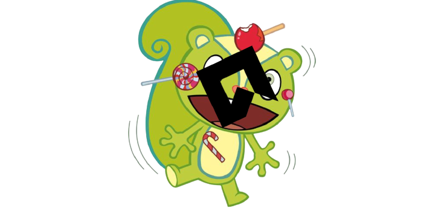

 </img>

# Behaviour Tree Friends

This is a implementation of a BT to Gamemaker studio 2.3+

We just started the project, so there's a lot of things to improve.

[Click here to see our board ](https://github.com/VitorEstevam/Behaviour-Tree-Friends/projects/1)

## Contributors

Made with [contributors-img](https://contrib.rocks).

## References

- https://en.wikipedia.org/wiki/Behavior_tree_(artificial_intelligence,_robotics_and_control)
- https://www.gamasutra.com/blogs/ChrisSimpson/20140717/221339/Behavior_trees_for_AI_How_they_work.php

And a especial thank you to [squircledev](https://github.com/squircledev) how shared some drafts with us :)
